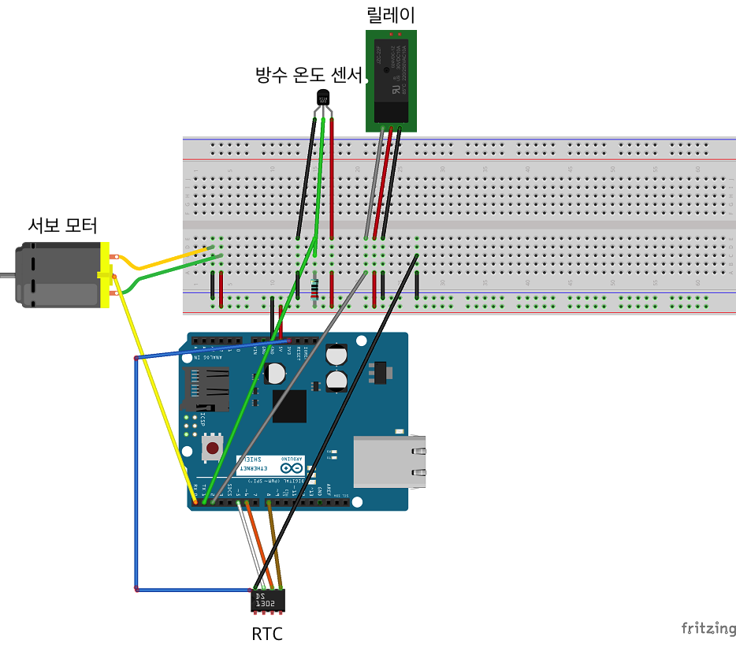

# 사남일녀 팀의 IoT 프로젝트 - 떡밥밥
  

## 시스템 구현 배경
1인가구가 점차 증가하는 요즘,  
사람들은 외로움을 달래기 위해 비용이 저렴한 물고기를 많이 키우고 있습니다.  
이러한 가운데 업무로 인해 장기간 집을 떠나거나 갑작스럽게 출장을 가야 할 경우가 생기게 됩니다.  
이러한 곤란한 문제를 해결하기 위해 만든 프로젝트 프로젝트입니다.  

## 개발 목표
* 플랫폼에 종속되지 않는 앱 개발.
* 소프트웨어와 하드웨어의 연동.
* WiFi 통신을 이용하여 원격지에서도 소프트웨어를 통해 하드웨어를 조작.

## 주요 기능
* 먹이주기  
  * 앱에서 버튼을 누르면 아두이노가 수동으로 먹이를 줌.  
  * 앱에서 먹이 줄 시간을 지정하면 해당 시간에 아두이노가 자동으로 먹이를 줌.  
  * 앱에서 대기 시간을 지정하면 먹이를 줄 때 해당 시간만큼 아두이노의 모터가 대기해 먹이의 양을 조절.  
* 수온 관리  
  * 일정 시간 마다 현재 수온을 업데이트.  
  * 수온에 따른 히터 ON/OFF 프로젝트와 별개로 히터 자체에서 제공.  
* 조명 관리  
  * 앱에서 버튼을 누르면 아두이노가 수동으로 조명을 켜고 끌 수 있음.  
  * 앱에서 시간을 지정하면 해당 시간에 맞춰 아두이노가 자동으로 조명을 켜고 끔.  

## 시연 동영상 (클릭하면 유튜브로 이동)
[프로젝트 소개 및 수동 밥주기  
](https://youtu.be/2OseNBOGf-I)

[자동 밥주기  
](https://youtu.be/iRZ_9KACgdI)

[수온 확인  
](https://youtu.be/9D9eewxVvQ8)

[수동 조명 관리  
](https://youtu.be/RsdsY-3NMPw)

[자동 조명 관리  
](https://youtu.be/q_kMgH9hR40)

## 아두이노 회로도

## 스펙
* **[Arduino 101(Genuino 101)](https://www.arduino.cc/en/Main/ArduinoBoard101 "Arduino 101(Genuino 101) 스펙 정보 페이지")** - 다양한 센서모듈을 이용한 조작이 가능한 하드웨어
* **[AngularJS 1](https://angularjs.org/ "AngularJS 공식 홈페이지")** - 싱글 페이지 어플리케이션 제작을 위해 구글에서 만든 자바스크립트 프레임워크
* **[Dothome 무료 호스팅](http://www.dothome.co.kr "닷홈 홈페이지")** - Apache 2.4(Web Server), PHP5.5(Server Side Script), MySQL 5.1(DBMS)

사용한 언어는 다음과 같습니다.
* **C++** - 아두이노에 심을 프로그램을 코딩할 때 쓰임.
* **ECMAScript 5(JavaScript)** - 웹 브라우저에서 돌아가는 어플리케이션을 코딩할 때 쓰임.
* **PHP 5.5** - DB 서버와 통신하기 위해 쓰임.

**[베타 버전](http://i4m1g.dothome.co.kr/demo/ "떡밥밥")**은 해당 링크에서 확인 가능합니다.  
스마트폰에서 정상적으로 보이며, PC에서 볼 경우에는 모바일 모드로 보실 것을 권장합니다.

아두이노에 사용한 모듈들은 다음과 같습니다.
* **와이파이 쉴드(TEL0064)** - 아두이노가 와이파이 통신을 하기 위한 모듈
* **방수 온도 센서(DS18B20)** - 수온을 재기 위한 모듈
* **Real Time Clock(DS1302)** - 시간 값을 저장하기 위한 모듈
* **릴레이(SRD-05VDC-SL-C)** - 조명의 전원 공급/차단을 위한 모듈
* **서보 모터(Servo – Generic)** - 먹이통을 제어하기 위한 모듈

## 사전에 설치해야할 사항
이 프로젝트를 개발하기 위해서는 아래와 같은 내용들이 설치돼있어야 합니다.

* **[Arduino IDE](https://www.arduino.cc/en/Main/Software "아두이노 통합 개발 환경 다운로드 페이지")** - 아두이노 프로그램 코딩을 위한 툴.
* **[OneWire](https://github.com/PaulStoffregen/OneWire "OneWire 정보 페이지")** - 아두이노에서 수온 센서를 위한 라이브러리.
* **[DS1302](http://cafe.naver.com/makeitfun/132 "DS1302 예제 및 라이브러리 다운로드 페이지")** - 아두이노에서 리얼 타임 센서를 위한 라이브러리.
* **[Apach 2.4](https://httpd.apache.org/download.cgi#apache24 "Apache 2.4 다운로드 페이지")** - PHP 5.5+와의 연동을 위해 필요한 웹 서버이다.
* **[PHP 5.5](http://windows.php.net/download#php-5.5 "PHP 5.5 다운로드 페이지")** - DB 서버와의 연동을 위해 필요한 서버 사이드 스크립트 언어이다.
* **[MySQL 5.1](https://www.mysql.com/downloads/ "MySQL 다운로드 페이지")** - 아두이노, 사용자 정보 등등의 정보를 저장하기 위한 DBMS이다.
* **[Node.js](https://nodejs.org/ko/ "Node.js 공식 홈페이지")** - npm을 사용하려면 필수이다.
* **[npm](https://docs.npmjs.com/getting-started/installing-node#updating-npm "npm Getting Started 문서")** - Node.js에서 사용되는 모듈을 패키지로 모아놓은 곳
* **[Bower](https://bower.io/#install-bower "Bower 공식 사이트")** - 웹 프론트 엔드 개발의 의존성 관리를 위한 패키지 관리자
* **[Git](https://git-scm.com/download/ "Git 다운로드 페이지")** - Bower를 통해 컴포넌트를 설치하기 위해서 필요하다.
* **[Gulp](https://github.com/gulpjs/gulp/blob/master/docs/getting-started.md#getting-started "Gulp Getting Started 문서")** - 빌드 자동화 도구

## 프로젝트 설치하기
이제 이 프로젝트를 사용할 준비가 끝난 것입니다.  
그럼 이제 이 프로젝트를 자신의 컴퓨터에 다운받도록 합니다.  
터미널(명령 프롬프트)을 열어 프로젝트 디렉토리로 이동한 후에

`$ git clone https://github.com/perfectacle/fish`

를 입력하면 프로젝트 내에 fish 디렉토리가 생성되며  
현재 프로젝트의 파일들이 모두 복사됩니다.  
참고로 dummy 폴더의 내용은 개발과는 전혀 상관 없으므로 삭제하셔도 무방합니다.

이제 터미널 상에서 fish 디렉토리로 이동해주도록 합시다.

### 웹 어플리케이션 개발 환경 구축하기
이제 컴포넌트를 설치할 차례입니다.

`$ npm i`  
`$ bower i`

를 입력하여 개발 시에만 사용할 컴포넌트,  
배포 시에도 사용할 컴포넌트를 프로젝트 내에 설치하시면 됩니다.

### DB 구축하기
DB를 구축하시려면 아래 파일의 쿼리문을 실행시키면 됩니다.

`/sql/db.sql`

### 아두이노 개발 환경 구축하기
아두이노 IDE를 설치하신 후에 OneWire와 DS1302 라이브러리를  
아두이노가 설치된 디렉토리로 가서

`Arduino\libraries` 

폴더에 추가하시면 됩니다.

## 프로젝트 개발하기
이제 실제로 프로젝트를 개발해볼 차례입니다.  
Arduino IDE, npm&Bower와 Gulp의 사용법은 설명하지 않도록 하겠습니다.  
해당 내용들은 다른 문서들을 통해 찾아보시기 바랍니다.  
`gulpfile.js`에 주석을 넣어놓았으므로 빌드를 고치실 분은 참고하시기 바랍니다.  

### 웹 어플리케이션 개발하기
개발을 진행하실 때는 아래와 같은 명령어를 입력한 후 개발을 진행하시면,  
생산성 향상에 도움이 될 것입니다.

`$ gulp `
 
위 명령어를 입력한 후에 개발을 진행하시면,  
SCSS 파일의 변화를 자동으로 감지하여 CSS 파일로 컴파일 해줍니다.

`/www/src`

위 디렉토리는 개발용 디렉토리입니다.

개발을 모두 마치고, 실제 배포를 위한 테스트를 진행하실 때는

`$ gulp build`

위 명령어를 입력하면

`/www/public`

위 디렉토리가 생성됩니다.  
위 디렉토리는 실제 배포용 디렉토리입니다.  
주석의 제거, 컴포넌트(CSS, JS)파일을 하나로 통합, 각종 파일(CSS, JS, 이미지 파일) 압축  
등등의 작업을 진행해 용량을 최소화 시키는 등의 작업을 거쳐 앱의 퍼포먼스를 증대시켜줍니다.
 
 `server/#/time`
 
 페이지로 이동하시면 현재 아두이노의 시간을 확인하실 수 있습니다.

### 아두이노 개발하기
기본 문법은 C/C++을 따르며 Arduino IDE로 해당 소스 파일을 여신 후에 코딩하시면 됩니다.  
컴파일을 마치신 후에 아두이노의 USB와 컴퓨터를 연결한 후에 컴파일한 파일을 업로드 하시면 됩니다.

`/arduino/fish.ino`

파일은 시리얼 통신을 하기 때문에 전원이 공급된 이후에도 시리얼 모니터를 켜야 정상 작동합니다.  
시리얼 모니터에 로그가 다 찍히기 때문에 디버깅하기에 수월한 소스입니다.  
시리얼 통신을 하지 않으시려고 하거나 따로 전원을 공급하시려는 분들은  
소스 코드의 주석을 참고해주시기 바랍니다.

### 내부(사설) IP 사용하기 (포트 개방이 불가능할 경우)
내부 IP는 동일한 네트워크 사이에서만 접근 가능한 IP입니다.  
즉 다른 네트워크(AP, 와이파이)를 사용하는 경우에는 서로 통신이 불가능합니다.  
이 경우에는 공유기의 관리자 권한으로 접근이 불가능하거나  
특정 포트의 사용이 불가능하여 불가피하게 테스트의 목적으로만 사용할 것을 권장합니다.

`/www/src/scripts/app.js`

파일을 여신 후에

`$rootScope.arduino = 'http://' + data['p_ip'] + ':' + data['port'];`

이 부분을 아래와 같이 고쳐주시면 됩니다.

`$rootScope.arduino = 'http://' + data['l_ip'] + ':' + data['port'];`

### 외부(공인) IP 사용하기 (포트 개방이 가능할 경우)
외부 IP는 동일한 네트워크가 아니더라도 접근 가능한 IP입니다.  
즉 다른 네트워크(AP, 와이파이)를 사용하는 경우에도 서로 통신이 가능합니다.  
아두이노는 와이파이에 연결시켜놓고, 핸드폰은 LTE 네트워크를 써도 서로간에 통신이 가능합니다.  
권장드리는 방안이며, 기본 설정입니다.  
필수적으로 공유기 관리 페이지로 가셔서 해당 포트를 꼭 개방시켜놓아야합니다.  
혹여 내부 IP 방식으로 수정하셨던 분들은 아래 설명을 따라 하시면 됩니다.

`/www/src/scripts/app.js`

파일을 여신 후에

`$rootScope.arduino = 'http://' + data['l_ip'] + ':' + data['port'];`

이 부분을 아래와 같이 고쳐주시면 됩니다.

`$rootScope.arduino = 'http://' + data['p_ip'] + ':' + data['port'];`

## 마치며

B/G 모드만 지원하는 와이파이 쉴드를 구매해서 통신에 부적합한 것을 뒤늦게 깨달아  
다소 완성도가 떨어지는 점도 존재합니다.(새로고침 한 이후에 데이터가 제대로 안 간다던지 등등)  
차후에 와이파이를 이용한 프로젝트는 좀 더 저렴하고 기타 부품들이 덜 필요한 라즈베리 파이를 이용해야 할 것 같습니다.  
문서와 프로젝트가 많이 부족하니 피드백은 아래 메일로 부탁드립니다.

<perfectacle@naver.com>
